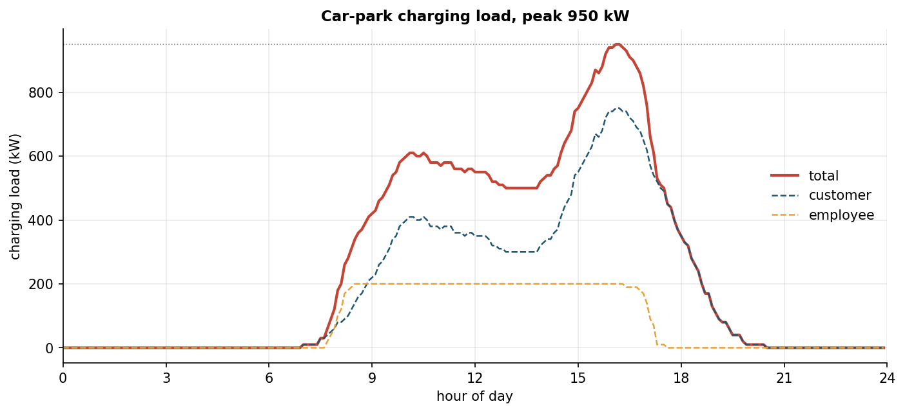

# ev-attendance-generator

Size a car park's electrical supply for the moment every charger runs flat out
and you will badly over-build it. Real fleets never behave that way: cars
arrive and leave across the day, so the peak demand sits far below the worst
case. This project builds a synthetic 24-hour charging-demand profile for a
workplace car park and reads off the peak the supply actually has to carry.

There is no metered data to lean on, so the load curve comes from behaviour
instead. Each group of vehicles gets a mixture-of-Gaussians arrival
distribution (a weighted sum of bell curves) and a matching departure
distribution over the hour of the day. The model samples a dwell time per
vehicle, counts how many are present at each step, and multiplies by the
charger rating. Sum the groups and you have the load the supply must be sized
for. That total lands well below every charger running at once, and the gap is
the diversity a behavioural model picks up and a naive sum throws away.

## Withheld engine and parameters

Two parts do the real work, and both are **encrypted in place with git-crypt**,
not published in readable form:

- `src/evattendance/_engine.py`: the generation engine. Builds the normalised
  mixture density, samples arrival and departure times, enforces that a vehicle
  leaves after it arrives, and counts occupancy across the day.
- `src/evattendance/_params.py`: the fitted behavioural parameters. The arrival
  and departure mixtures per group, the fleet sizes, and the charger rating
  behind the published load curve.

The repo carries an encrypted copy of both.

## Results



The summed load curve and its two groups, with the peak the site has to support
marked. From [notebook 01](notebooks/01_charging_demand_profile.ipynb).

## Notebook

1. [`01_charging_demand_profile`](notebooks/01_charging_demand_profile.ipynb): the
   behavioural distributions, the occupancy per group, and the summed load curve
   with its peak.

## Layout

```
src/evattendance/
  profiles.py    public: CategorySpec data classes, config loader, orchestration
  _engine.py     withheld, git-crypt encrypted: mixture sampling and occupancy
  _params.py     withheld, git-crypt encrypted: fitted fleet parameters
  plotting.py    shared style, palette and figure saver
scripts/
  generate_profiles.py   sample the fleet -> artifacts/ (profile + densities)
config/
  profiles.example.yaml  placeholder fleet showing the config structure
notebooks/       analysis notebook (executed, with figures)
docs/method.md   the method, with the withheld parts described but not implemented
```

## Reproduction

```bash
pip install -e .
python scripts/generate_profiles.py     # needs the decrypted engine and parameters
jupyter nbconvert --to notebook --execute --inplace notebooks/01_charging_demand_profile.ipynb
```

A fleet can also be described entirely in configuration:

```bash
python scripts/generate_profiles.py --config config/profiles.example.yaml
```

but the example uses placeholder numbers and the engine is withheld, so this path
documents the interface rather than reproducing the published results.

`pytest` covers the config loader and, when the engine is present, the sampling
and aggregation. `ruff` handles lint and formatting.

## Licence

MIT for the code.
