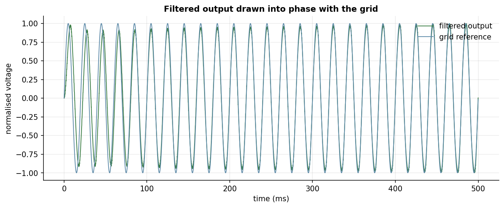
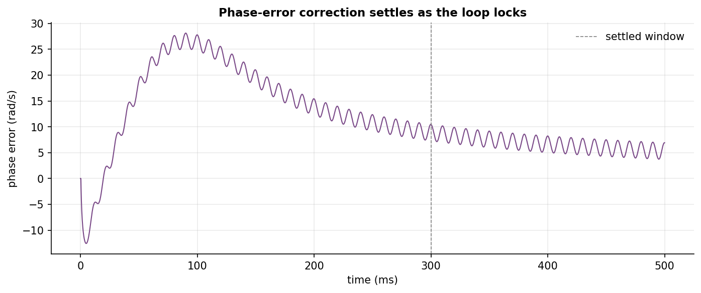
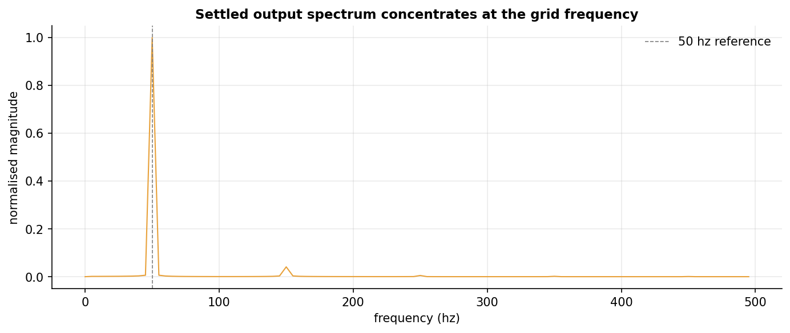

# inverter-model

A grid-following inverter has no authority of its own. It cannot dictate voltage
and frequency to a live grid the way a large synchronous generator can; it has
to measure what the grid is doing and fall into step. This project simulates one
in the time domain: a boost converter, a sinusoidal PWM modulator, an output
filter and an analogue phase-locked loop (PLL), cascaded and integrated on a
fixed time grid. A 50 Hz reference stands in for the grid, and the closed loop
steers the inverter output into step with it.

The interesting part is the synchronisation itself: how a closed loop pulls a
free-running modulator into phase and then holds it there.

## The model

Because a grid-following inverter cannot impose its own voltage and frequency,
it has to match what it measures. The model is four stages, each stepped once
per integration step:

| Stage | Role |
| --- | --- |
| Boost converter | steps a 2.5 V dc source up to a usable dc link by hard PWM switching at the carrier frequency |
| Sinusoidal PWM modulator | chops the link into a pulse train whose widths trace a sine, synthesising a mains-frequency waveform |
| Output filter | a first-order RC low pass with its corner just above the mains line, recovering the sinusoid from the ripple |
| Phase-locked loop | two analogue peak detectors and a phase comparator that returns a frequency correction to the modulator |

The only feedback is the loop's scalar phase error, trimming the modulator's
output frequency. The `power.power_settings` helper sizes the operating point
separately: from a requested active and reactive power it returns the line
current and inverter terminal voltage needed to push that apparent power into
the inductive grid tie. Control architecture, state-update equations and the
full parameter table are in [`docs/model.md`](docs/model.md).

Integration is the expensive bit. The 2 MHz carrier is resolved over half a
second of simulated time, about 2.5 million steps. That runs once in
`scripts/run_simulation.py`, which writes the waveforms to `artifacts/sim.npz`.
The notebook just reads them.

## Results

The loop locks, which is the whole point. The phase-error correction overshoots
as it first catches the grid, then decays to a steady value, with the ripple
band narrowing by roughly a factor of five. The settled output spectrum sits on
the 50 Hz line with only weak switching harmonics.







## Notebooks

1. [`01_grid_following_inverter`](notebooks/01_grid_following_inverter.ipynb):
   the boost-stage dc link, the raw sinusoidal-PWM waveform, the filtered output
   over the grid reference, the phase error converging, and the settled output
   spectrum confirming lock at 50 Hz.

## Reproduction

```bash
pip install -e .

python scripts/run_simulation.py    # integrate the cascade -> artifacts/sim.npz
jupyter nbconvert --to notebook --execute --inplace notebooks/01_grid_following_inverter.ipynb
```

The default config integrates 0.5 s at a 2e-7 s step and finishes in under
fifteen seconds. The horizon, step and every electrical parameter live in
`config/default.yaml` and can be overridden with `--config`.

## Licence

MIT for the code. See the repository root `LICENSE`.
