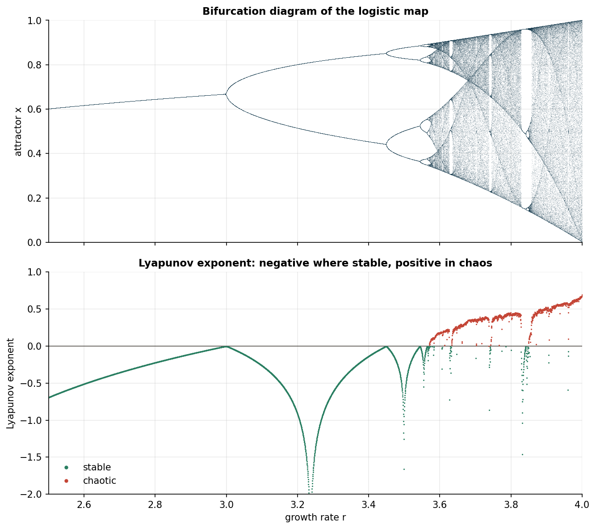
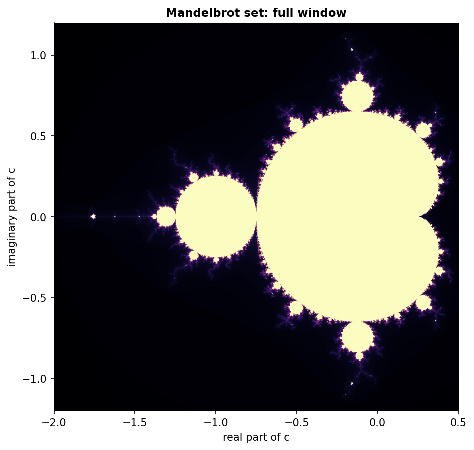
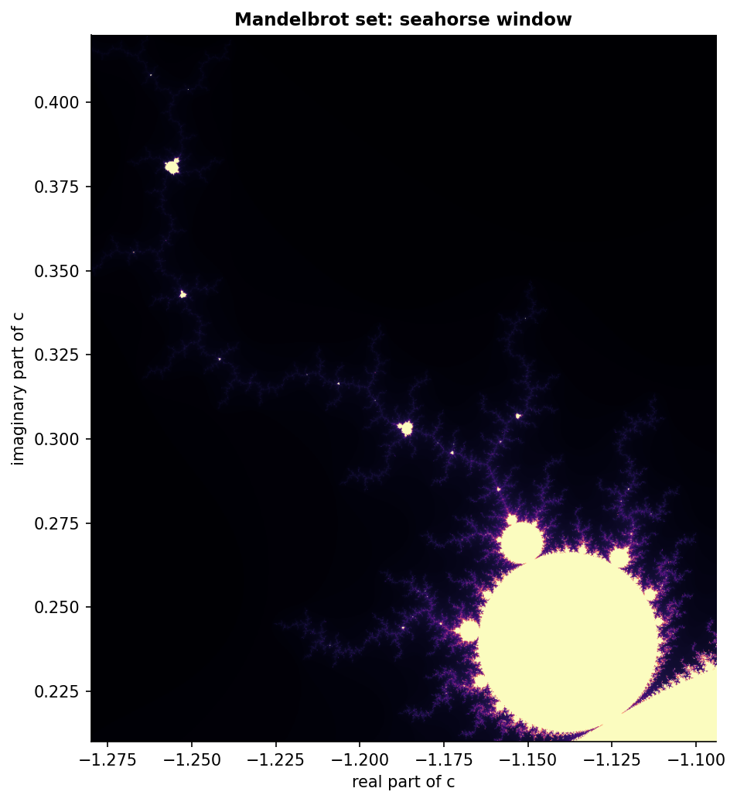
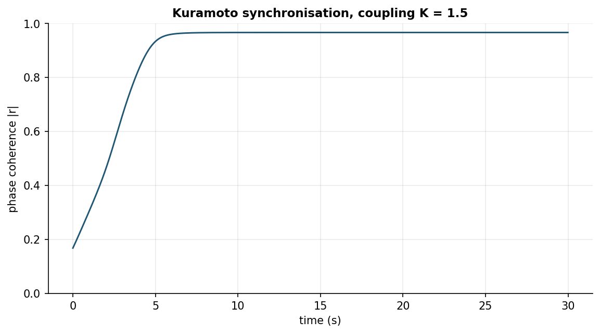

# nonlinear-dynamics

Determinism is meant to buy you predictability. These four experiments are about
the cases where it does not: simple, fixed rules that still produce behaviour you
cannot forecast. I pulled them out of scattered exploratory notebooks into one
installable library: the logistic map and its period-doubling route to chaos, the
Lyapunov exponent that measures that chaos, the escape-time Mandelbrot set, and a
Kuramoto model of cicadas falling into a common rhythm. The thread through all
four is the same. Simple deterministic rules, complex and often unpredictable
behaviour.

## The experiments

| System | Question | Tool |
| --- | --- | --- |
| Logistic map | How does a single growth rate take a population from a steady state, through period doubling, into chaos? | trajectories, cobweb construction |
| Bifurcation and Lyapunov | Where exactly are the stable windows and the chaotic bands, and how strongly do nearby orbits diverge? | bifurcation diagram, Lyapunov exponent |
| Mandelbrot set | Which complex parameters keep the quadratic iteration bounded, and what does the boundary look like under magnification? | vectorised escape-time rendering |
| Kuramoto cicadas | When does a population of coupled oscillators with scattered natural frequencies lock into synchrony? | order parameter over time |

## Results

The logistic map is stable below `r = 3`, period-doubles through the cascade and
turns chaotic near `r = 3.57`, with narrow periodic windows mixed in. The
bifurcation diagram and the Lyapunov exponent say the same thing two ways: the
exponent is negative wherever the diagram shows a finite set of points, and
crosses zero into positive exactly where the diagram fills in.



The Mandelbrot set is rendered by escape time over the whole plane and into two
deeper windows. The boundary stays intricate at every magnification.





A Kuramoto population of fifty oscillators with spread natural frequencies and a
coupling above the critical value locks together: the order parameter climbs
from near zero to close to one as the oscillators synchronise.



## Notebooks

1. [`01_logistic_map`](notebooks/01_logistic_map.ipynb): the map, single
   trajectories at a few growth rates, the cobweb construction, and a parameter
   sweep that previews the cascade.
2. [`02_bifurcation_and_lyapunov`](notebooks/02_bifurcation_and_lyapunov.ipynb):
   the bifurcation diagram swept across `r`, the Lyapunov exponent from the
   orbit, and the stable and chaotic regions read off together.
3. [`03_mandelbrot`](notebooks/03_mandelbrot.ipynb): the vectorised escape-time
   render, the region abstraction, and the documented zoom windows.
4. [`04_kuramoto_cicadas`](notebooks/04_kuramoto_cicadas.ipynb): the coupled
   oscillator simulation, the order parameter tracking synchronisation, a sweep
   over coupling strength, and the magnitude spectrum of a chorus recording when
   one is supplied.

## Library

```
src/nldynamics/
  logistic.py     logistic_map, iterate, cobweb, bifurcation, lyapunov_exponent
  mandelbrot.py   Region dataclass, vectorised escape_counts, documented ZOOMS
  kuramoto.py     simulate_kuramoto, order_parameter, audio_spectrum helper
  plotting.py     setup_style, palette, save_figure
```

The numerics are vectorised throughout. The bifurcation sweep and the Lyapunov
exponent advance every value of `r` as one ensemble, the Mandelbrot render
iterates the whole complex grid with an escape mask rather than a per-pixel loop,
and the Kuramoto coupling sum is formed by broadcasting. The point is to keep the
heavy loops in numpy rather than Python.

## Reproduction

```bash
mamba env create -f ../environment.yml
conda activate elec-eng-public
pip install -e .

python scripts/run_logistic.py        # trajectories + sweep -> artifacts/
python scripts/run_bifurcation.py     # bifurcation + Lyapunov -> artifacts/, figure
python scripts/render_mandelbrot.py   # escape-count grids -> artifacts/, zoom PNGs
python scripts/run_kuramoto.py        # simulation + coupling sweep -> artifacts/, figure

jupyter nbconvert --to notebook --execute --inplace notebooks/01_logistic_map.ipynb
```

The heavy computation lives in the scripts, which write their results to
`artifacts/` (gitignored). The notebooks read those arrays and draw them, so each
notebook stays light. Run the scripts once before the notebooks. The committed
figures in `reports/figures/` come from the scripts, and everything runs from a
clean checkout with no downloads. The cicada recording used by the spectrum
section of notebook 04 is a large field capture that is not committed (see
`data/README.md`); that section detects its absence and is skipped. The
simulation itself needs no audio.

## Licence

MIT for the code. See `../LICENSE`.
