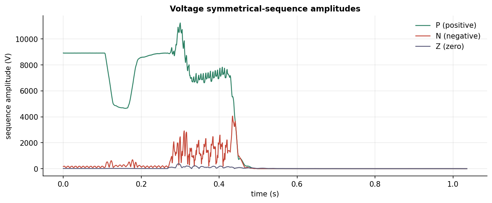

# sequence-analysis

When a three-phase supply goes wrong, it tells you how in the way its phases
fall out of balance. The job is to read that signal. This project takes a short
burst of three-phase battery telemetry and reads it as a sum of *symmetrical
sequence components*: balanced sets that, added together, reconstruct any
unbalanced three-phase measurement. It estimates the fundamental phasor of each
phase cycle by cycle and resolves the three into zero, positive and negative
sequence with the inverse Fortescue transform. Slide that one-cycle window
across the record and you get sequence time series that surface imbalance and
fault signatures over time.

Here is why the decomposition earns its keep. A balanced supply is pure positive
sequence. Negative sequence shows up with phase-to-phase faults, zero sequence
with earth faults, so the three components read together tell you what kind of
disturbance you are looking at.

## Withheld kernel

The original part of this work, the per-cycle phasor estimator, the
symmetrical-component transform and the harmonic-to-sequence classification, sits
in `src/seqanalysis/_kernel.py`. That file is **encrypted in place with
git-crypt**. The repo carries the full encrypted blob, but without the key it is
just ciphertext, so the method is not published in readable form.

Everything else is open. `src/seqanalysis/sequence.py` is the public interface to
the kernel. With the kernel present it runs and reproduces the figures below.
Without it the decomposition functions raise a clear error explaining what is
missing. The committed notebooks keep their executed results, so the analysis
still reads end to end. Only the method and its numbers are held back.

## Results



Positive sequence dominates throughout. The negative and zero sequences are
small but move about; their ratio to the positive sequence is the
voltage-unbalance factor. Produced in
[notebook 02](notebooks/02_symmetrical_components.ipynb).

## Notebooks

1. [`01_harmonic_sequence_view`](notebooks/01_harmonic_sequence_view.ipynb): raw
   waveforms, one fundamental cycle, and the sequence content read indirectly by
   grouping the windowed spectrum into harmonics.
2. [`02_symmetrical_components`](notebooks/02_symmetrical_components.ipynb): the
   direct per-cycle phasor decomposition into zero, positive and negative
   sequence, plus the unbalance factor and the sequence phase offsets.

## Layout

```
src/seqanalysis/
  io.py          load and tidy the telemetry, recover the sampling and cycle length
  sequence.py    public decomposition interface (calls the withheld kernel)
  _kernel.py     withheld, git-crypt encrypted: phasor estimate + Fortescue transform
  plotting.py    shared style, palette and sequence-series helper
scripts/
  run_sequence_analysis.py   sliding-window decomposition -> artifacts/ (parquet)
notebooks/       analysis notebooks (executed, with figures)
docs/method.md   the method, with the withheld parts described but not implemented
data/            telemetry CSV (gitignored; see data/README.md)
```

## Reproduction

```bash
pip install -e .
python scripts/run_sequence_analysis.py   # decomposition -> artifacts/ (needs the decrypted kernel)
jupyter nbconvert --to notebook --execute --inplace notebooks/01_harmonic_sequence_view.ipynb
jupyter nbconvert --to notebook --execute --inplace notebooks/02_symmetrical_components.ipynb
```

The telemetry CSV is real measurement data, so it is gitignored rather than
redistributed (see `data/README.md`). The decomposition step needs the decrypted
kernel. Without it the scripts and notebooks say the kernel is withheld and fall
back to the committed results.

## Licence

MIT for the code. The telemetry is not included.
